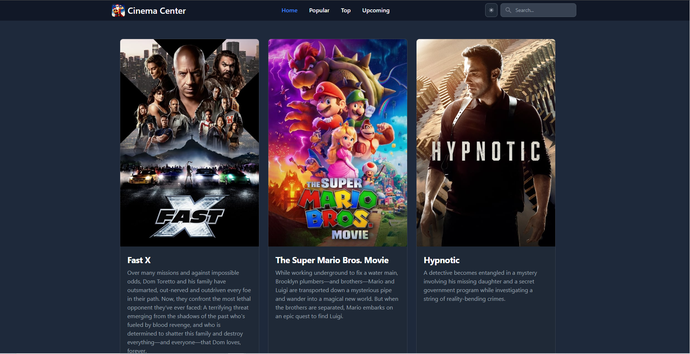

## Cinema Center

This movie catalog is a web application built for movie enthusiasts. It pulls data from TMDB API to display a variety of movie lists including: Now Playing, Popular, Top Rated, and Upcoming movies. It also includes a detailed page for each movie and a search functionality. With its user-friendly interface and the added dark mode toggle, browsing through movies has never been this enjoyable. You can check out the live project [here](https://cinema-center.netlify.app).

## Features 
- **Movie Lists** Get updated with the latest movie trends
- **Detailed Movie Pages** Each movie has its own detailed page that provides additional information including a link to the IMDB listing for more comprehensive insights
- **Search Bar** Easily find the movies you're looking for with the application's search bar
- **Dark Mode** Choose the theme that fits your style. The application provides a dark mode toggle for a more comfortable browsing experience
- **Dynamic Routing** This app uses dynamic routing from react-router-dom, providing a seamless navigation experience
- **Dynamic Page Titles** Each page has a dynamic title that adjusts based on the current page the user is viewing
- **Responsive Design** Works flawlessly on any device.

## Tech Stack
- JavaScript
- React
- Tailwind CSS
- Flowbite
- React Router Dom
- TMDB API

## Contact

I'd love to hear from you about this project! If you have any questions, feedback, or potential collaboration opportunities, feel free to get in touch.

- [Email](mailto:johnclapper89@gmail.com)
- [LinkedIn](https://www.linkedin.com/in/john-clapper-476069192)
- [GitHub](https://github.com/britzky)

